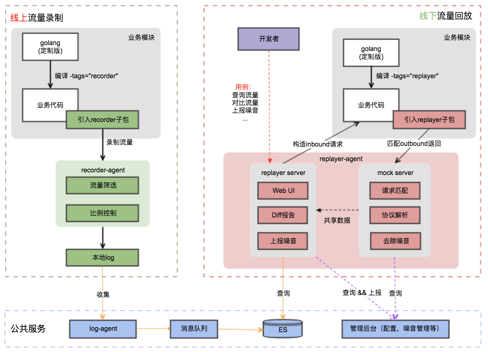
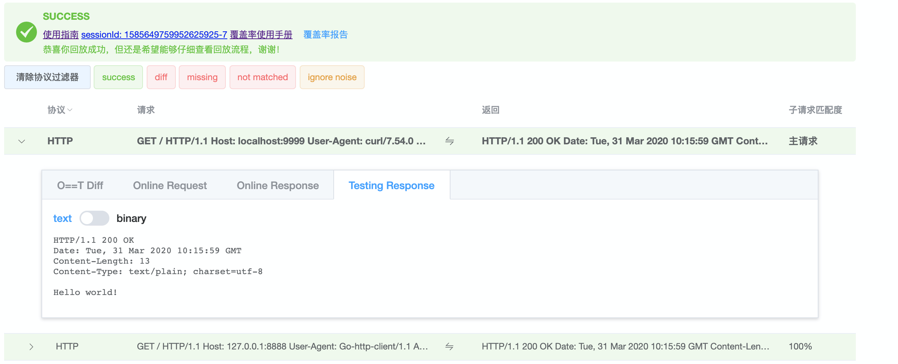
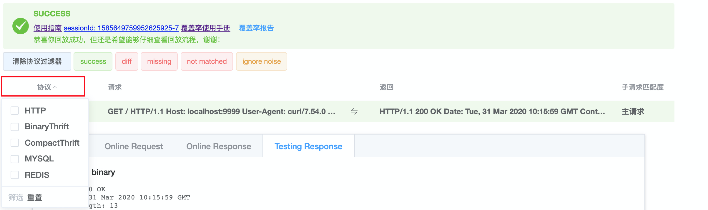
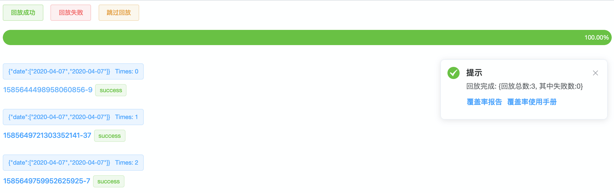
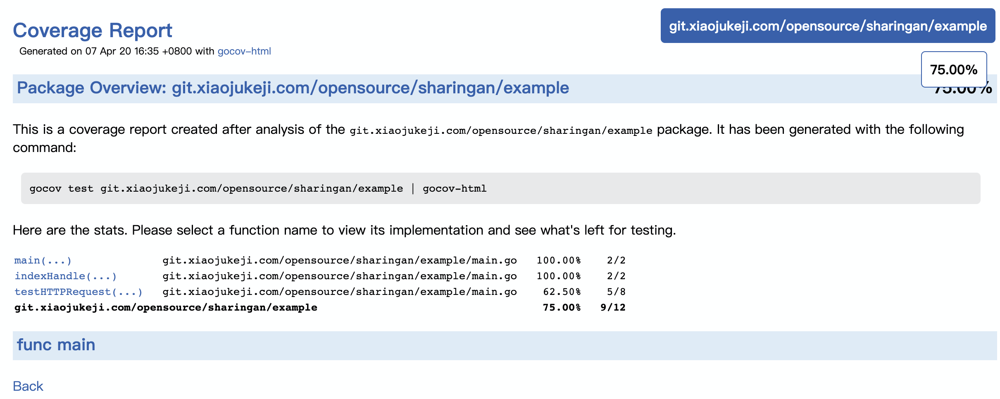
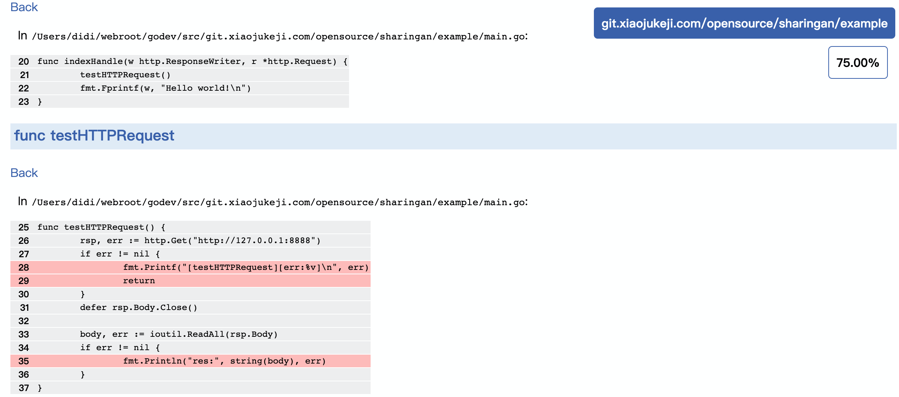

# Sharingan

[](https://github.com/didichuxing/sharingan/blob/master/LICENSE)

Sharingan，中文名：写轮眼，是漫画《火影忍者》中的一种瞳术，具有复制、幻术等能力，在幻术世界里，一切因素包括时间，地点，质量等，都由施术者掌控。

## 一、简介

Sharingan（写轮眼）是一个基于golang的流量录制回放工具，录制线上真实请求流量，在线下进行回放测试，适合项目重构、回归测试等。

### 1.1、背景

随着微服务架构的兴起，服务之间的依赖关系变的越来越复杂，软件测试也面临新的挑战：系统升级频繁、服务依赖众多等等。

* 常见的测试方案（如：单元测试、系统测试等）构造和维护测试用例成本高，特别是业务复杂的场景。「构造测试数据**难**」
* 依赖第三方服务众多，线下测试环境不太稳定，经常出现下游服务挂掉导致测试失败的情况发生。「维护测试环境成本**高**」

为此，我们需要开发一套工具解决上述问题。

### 1.2、方案

* 录制线上服务真实请求流量（包括下游调用流量），在线下进行回放，解决构造测试数据难的问题。「复制能力」
* 回放的时候匹配Mock下游调用，不再依赖具体的下游服务，解决维护测试环境成本高的问题。「幻术能力」

### 1.3、优势

* 支持下游流量录制。相比[tcpcopy](https://github.com/session-replay-tools/tcpcopy)、[goreplay](https://github.com/buger/goreplay)等方案，回放不依赖下游环境。
* 支持并发流量录制和回放。录制对服务影响小，回放速度更快。
* 支持重置时间、去除噪音、批量回放、覆盖率报告、常见协议解析等等。
* 不依赖业务框架，低应用浸入。

## 二、快速开始

### 2.1、使用示例

```shell
# Step1: 使用定制版golang，以go1.13为例
$ curl https://raw.githubusercontent.com/didichuxing/sharingan-go/recorder/install/go1.13 | sh
$ export GOROOT=/tmp/recorder-go1.13
$ export PATH=$GOROOT/bin:$PATH

# Step2: 下载sharingan项目
$ git clone https://github.com/didichuxing/sharingan.git
$ cd sharingan

# Step3: 编译、后台启动replayer-agent
$ cd replayer-agent
$ go build
$ nohup ./replayer-agent > run.log 2>&1 &

# Step4: 编译、启动示例example
$ cd ../example
$ go build -tags="replayer" -gcflags="all=-N -l"
$ ./example

# Step5: 打开回放页面
$ 浏览器打开，http://127.0.0.1:8998 # 非本机替换IP即可
$ 页面选择要回放的流量点执行          # 内置提前录制好的3条示例流量
```

### 2.2、接入文档

> **先录制再回放**

* [录制接入文档](./doc/recorder/README.md)
* [回放接入文档](./doc/replayer/README.md)

## 三、技术方案

### 3.1、模块划分

* recorder: 流量录制包，线上录制的时候项目需要引用
* recorder-agent：流量录制agent，单独的进程启动，可以控制录制比例、流量存储等等
* replayer: 流量回放包，线下回放的时候项目需要引用
* replayer-agent：流量回放agent，单独的进程启动，可以查询录制流量、查询/上报噪音、流量diff、批量回放、生成覆盖率报告等等

### 3.2、整体架构图



### 3.3、录制方案

* 修改golang源码，对外暴露Hook接口「所有改动通过官方测试用例」
* 提供API串联不同goroutine之间的网络调用「常见的http、mysql、redis流量都不需要特别设置」
* 提供单独的agent筛选流量、控制比例
* 更多参考：[流量录制实现原理](https://github.com/didichuxing/sharingan/wiki/%E6%B5%81%E9%87%8F%E5%BD%95%E5%88%B6%E5%AE%9E%E7%8E%B0%E5%8E%9F%E7%90%86)

### 3.4、回放方案

* 连接重定向：将服务所有Connect网络调用重定向到Mock Server「安装replayer-agent时候自带」
* 流量匹配：Mock Server会根据服务真实的下游请求匹配一个返回「mock下游调用」
* 重置时间：将程序执行时间回放到录制时刻，消除时间带来的干扰
* 去除噪音：提供API可以将已知的噪音流量去掉，如：traceID，每次请求本来就不一样
* 常见协议解析：会解析http、mysql、redis、thrift等协议，方便diff对比
* 更多参考：[流量回放实现原理](https://github.com/didichuxing/sharingan/wiki/%E6%B5%81%E9%87%8F%E5%9B%9E%E6%94%BE%E5%AE%9E%E7%8E%B0%E5%8E%9F%E7%90%86)

## 四、效果展示

### 4.1、流量回放

#### 4.1.1、单个回放



对于下游请求很多且复杂的情况，支持对下游协议进行筛选


#### 4.1.2、批量回放

批量回放的并发度默认是10，可通过增加[-parallel](https://github.com/didichuxing/sharingan/blob/master/replayer-agent/control.sh#L48)参数修改。


### 4.2、覆盖率报告

#### 4.2.1、整体报告

覆盖率报告支持覆盖率结果累计，即支持 多次 单个回放和批量回放后，统一生成覆盖率结果。


#### 4.2.1、覆盖详情



## 五、更多

### 5.1、如何贡献

欢迎大家参与进来，更多参考[Contribute](./CONTRIBUTING.md)

### 5.2、许可

基于Apache-2.0协议进行分发和使用，更多参考[LICENSE](./LICENSE)

### 5.3、感谢

特别感谢 [TaoWen](https://github.com/taowen) ，流量录制和回放初版设计者
