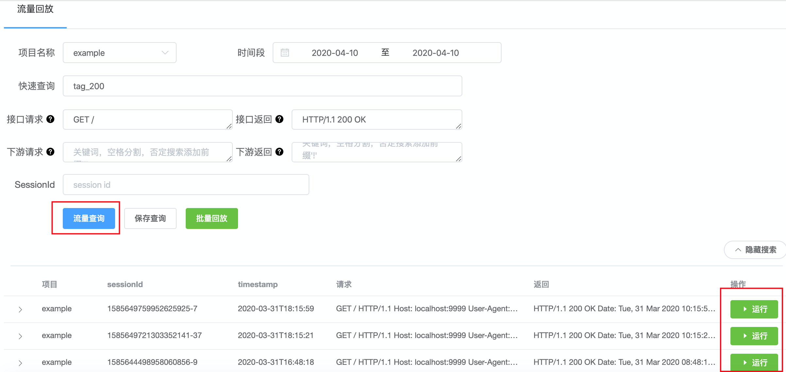

# 流量回放

流量回放，即基于录制的流量在线下对改造后的代码进行回放，以验证线下代码逻辑的正确性。其中，流量录制可以根据需求，录制线上机器的真实流量，或者录制本地机器的测试流量。

### 一、名词解释
* **SUT**: System Under Test, 在这里特指被测业务服务。目前仅支持对外提供HTTP接口的SUT回放。
* **Inbound**: 指SUT对外提供的HTTP接口的请求和响应，即Inbound Request/Response。
* **Outbound**: 指SUT提供的http接口内调用的下游请求和响应，即Outboud Request/Response。目前支持的Outbound协议有 MYSQL、REDIS、HTTP、Binary Thrift、Compact Thrift。
* **流量**: 指在TCP层对SUT录制的Inbound请求/响应 和 对应的Outbound请求/响应。
* **回放**: 基于录制的一条流量，Agent根据Inbound Request构造HTTP Request并对SUT发起请求；其中SUT的Outbound请求会发送到Mock Server进行流量匹配并返回Outbound响应；最后，Agent将收到的SUT HTTP Response与Inbound Response做对比，给出回放结果。
* **Agent**: 包括回放过程的Web Server和Mock Server。其中Web Server默认监听8998端口，主要负责流量搜索，回放请求的构造和发起，以及回放结果的对比和展示。
* **Mock Server**: 默认监听3515端口，主要负责接收SUT的下游请求，然后与回放流量的Outbound请求匹配，将最匹配的Outbound响应返回SUT。
* **噪音**: 即在Inbound Response对比和Outbound Request匹配过程里，出现的不影响回放结果和匹配度的diff字段，如时间戳。Agent回放结果页支持上报噪音，方便再次回放时精确回放结果。
* **DSL**: 特指ElasticSearch的查询DSL。Agent首页支持上报流量查询DSL，方便后面直接复用。

### 二、回放接入

回放前提：已经完成流量录制。[录制接入文档](../recorder/README.md)

##### 1. 配置并启动SUT

> 需要使用定制的golang，并通过指定tag来编译 引入回放包的SUT代码。

首先，配置定制版golang环境，目前支持go1.10、go1.11、go1.12、go1.13。亦可参考：[golang安装](https://github.com/didichuxing/sharingan-go)
```shell script
curl https://raw.githubusercontent.com/didichuxing/sharingan-go/recorder/install/go1.10 | sh
&& export GOROOT=/tmp/recorder-go1.10
&& export PATH=$GOROOT/bin:$PATH
```

然后，修改SUT的main.go代码，引入回放包。参考：[example](../../example/replayer/main.go)
```go
import _ "github.com/didichuxing/sharingan/replayer"
```

最后，编译并启动SUT服务。
```shell script
go build -tags="replayer" -gcflags="all=-N -l"
&& nohup ./$project 2>&1 &
```
> SUT一键接入&&启动脚本([./example/replayer/sut_replayer.sh](../../example/replayer/sut_replayer.sh))及[使用方法](./replayer-sut.md)

##### 2. 配置并启动Agent

> 温馨提示：Agent默认配置的是 **[本地回放](#4本地回放)**，即 仅依赖本地配置文件的回放。
* 如需 读取录制的线上流量，只需根据[回放Agent配置](./replayer-conf.md#5-es_url)修改es_url字段即可；
* 如需 读取上报到自有服务的噪音或DSL，只需根据[回放Agent配置](./replayer-conf.md#4-http_api)修改http_api字段即可；
* 如需 新增本地回放模块，请参考[本地回放接入](./replayer-local.md)。

首先，确保本地存在go环境(官方或定制版均可，且版本无要求), 并根据本地go版本选择go mod或glide来安装sharingan的依赖。
```shell script
glide install || go mod download
```
然后编译并启动Agent：
```shell script
cd ./replayer-agent && go build && nohup ./replayer-agent 2>&1 &
```

至此，浏览器打开 [http://127.0.0.1:8998](http://127.0.0.1:8998) 即可开始回放啦~

> Agent一键安装&&启动脚本([./replayer-agent/control.sh](../../replayer-agent/control.sh))及[使用方法](./replayer-agent.md)

### 三、使用手册

按照上面的接入流程逐步操作 并 成功启动SUT和Agent后，即可开始回放之旅~

首页点击"流量查询"搜索流量后，即可点击"运行"开始回放。


##### 1.指南

为了大家能够轻松、愉悦地开始回放过程，特意整理了回放过程中常见的使用技巧及指南，方便大家进一步理解流量回放。

[流量 搜索指南](./guide/search.md)

[流量 回放指南](./guide/replay.md)

[噪音/DSL 上报指南](./guide/report.md)

##### 2.覆盖率统计

流量回放不仅支持上面[接入流程-配置并启动SUT](#1-配置并启动sut)展示的普通回放接入，还支持覆盖率统计方式的回放接入。

[覆盖率统计接入](./replayer-codecov.md)

##### 3.批量并发回放

流量回放不仅支持单个流量回放，还支持多个流量批量并发的回放。

[批量并发回放](./replayer-parallel.md)

##### 4.本地回放
本地回放 即 仅依赖本地配置文件的回放。 流量 读取本机录制的测试流量，噪音和DSL 读取上报到本机的噪音和DSL，模块信息 读取自本机配置文件。

[本地回放接入](./replayer-local.md)

Agent默认配置的本地回放，如需修改，请参考：[回放Agent配置](./replayer-conf.md#4-http_api)

### 四、常见问题
[常见问题及排查](./guide/troubleshoot.md)

### 五、回放原理
[回放原理详解](./replayer-theory.md)