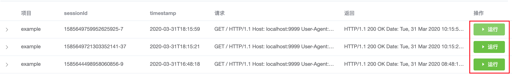
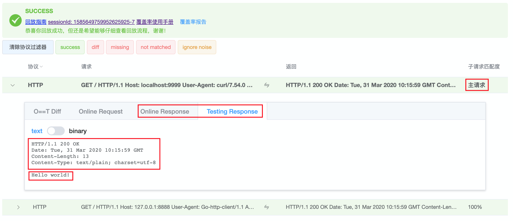
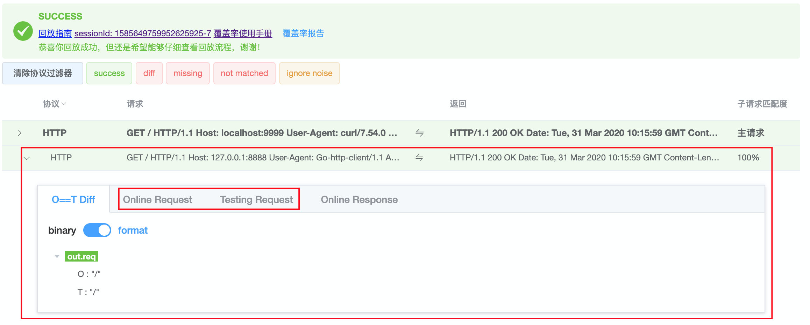
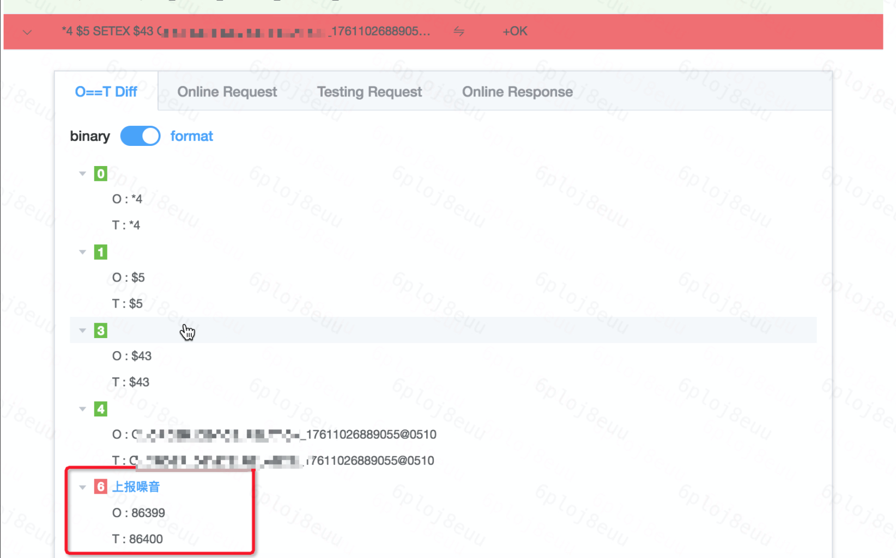
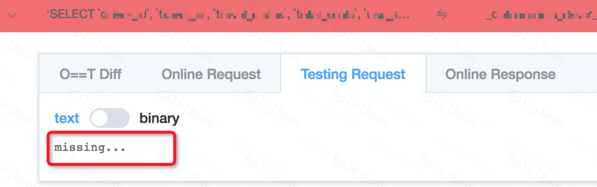
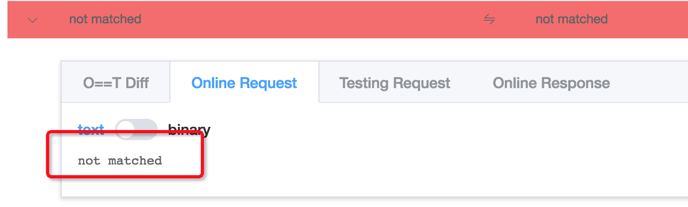
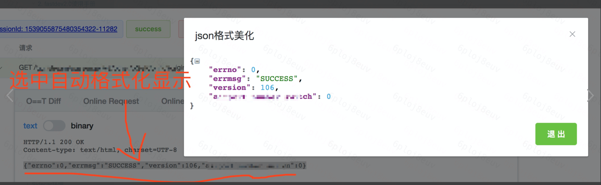
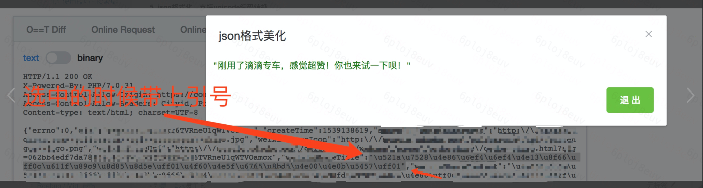

### 流量回放指南

 

流量回放指南 可以帮助对我们进一步了解回放结果页的流量状态及字段，加深我们对回放结果的理解，提升问题定位的能力。

 
下面逐个介绍：

##### 1. 查看接口返回
点击下图1的"运行"后，会进入图2的流量回放结果页。

下图2的流量回放结果页，第一条请求，即Inbound请求，标注为"主请求"。其余请求均为Outbound请求。

主请求里的 'Testing Response'，就是SUT针对Inbound请求的返回结果，包括header头和body体。

> 注意：
>
>对比上图2和上图3，只有Inbound请求的'O==T Diff' tab给的是Response的diff结果。 所有Outbound请求的'O==T Diff' tab给的是Request的diff结果。

 

##### 2. 定位失败原因

回放Agent采用了非常严格的测试标准，只要有任何diff或者异常都会显示回放失败，目的是为了让大家能够发现隐藏问题

对于回放失败的结果，还可以细分如下：

> 状态1：存在diff

如上图，点击飘红的行，存在飘红的字段。

根据代码可以区分出这个是一个“噪音”(每次都是随机数)，可以点击"上报噪音"消除噪音，被消除噪音在下次回放时就消失了。

 

> 状态2：missing

出现上图情况，是因为被测代码缺少一条请求，这个时候就要确认是否有删除或者改动代码有问题。亦可详见：[常见问题及排查](./troubleshoot.md#5-部分outbound匹配失败ot-diff没有diff) 第5条。

 

> 状态3：not matched

出现上图情况，是因为被测代码发出了线上流量没有的请求，匹配不到，所以可能也是代码中加入了新的逻辑。亦可详见：[常见问题及排查](./troubleshoot.md#5-部分outbound匹配失败ot-diff没有diff) 第5条。

 

更多问题，请详见 [常见问题及排查](./troubleshoot.md) 手册，及里面的 **[Sharingan交流群](./troubleshoot.md#交流群)**。

 

##### 3. 格式化
> 支持json格式化

选中json代码片段，当松开鼠标按钮的时候就会将其格式化显示。如下图所示

 

> 支持unicode编码转换

选中带引号的unicode编码片段即可。因为 带引号的片段会当成json格式处理，自动会进行编码转换

