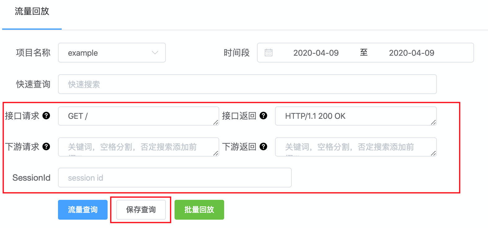
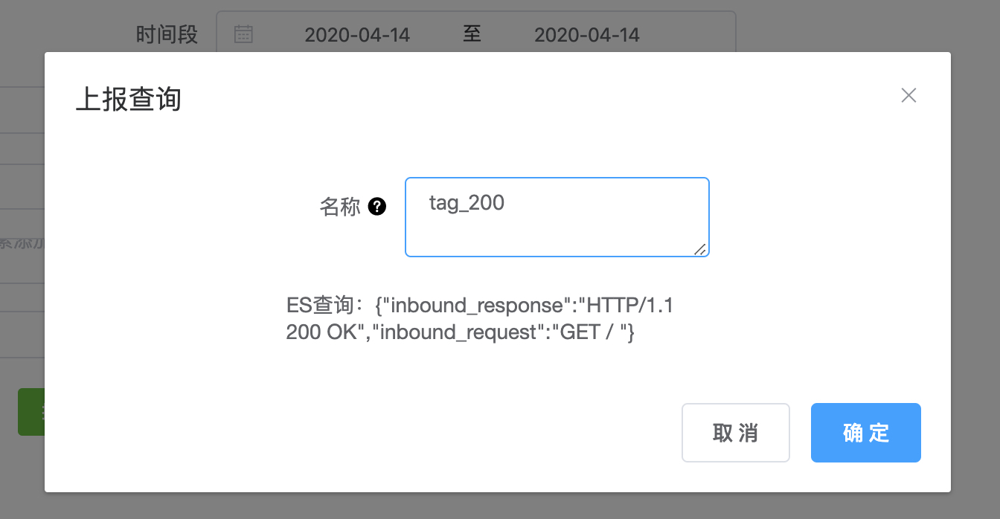
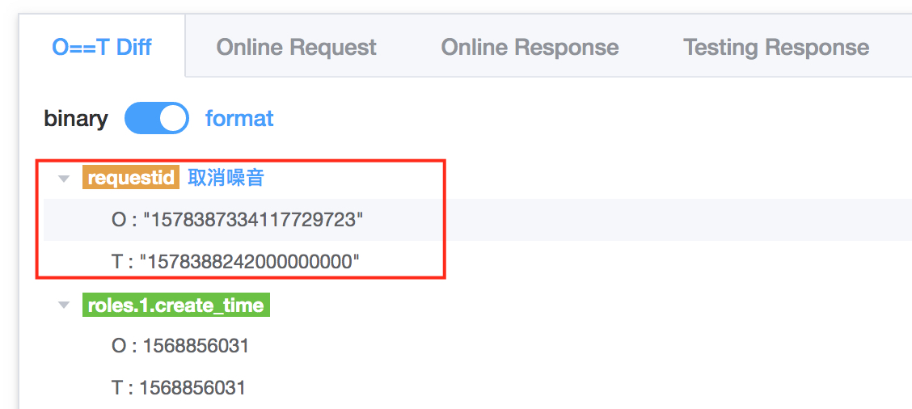

### 噪音/DSL 上报指南

 

回放过程中，为了提升回放体验、回放效率及回放成功率，Replayer-Agent特意提供了噪音/DSL上报功能。

 
下面详细介绍 DSL和噪音 上报的方法及注意事项：

##### 1. DSL上报

根据 [流量搜索指南-1. 搜索界面介绍](./search.md#1-搜索界面介绍) 可知，Replayer-Agent提供的流量搜索条件分的很细。为了节省流量搜索时间，Replayer-Agent提供了DSL上报功能。

> 上报DSL：

  1. 填好图1红框字段后，点击"流量查询"。字段说明详见：[流量搜索指南](./search.md#1-搜索界面介绍)
  2. 选择一个流量，点击"运行"，验证流量是否回放成功，是否符合预期
  3. 若筛出的流量符合预期，则点击"保存查询"，弹出图2弹出框，输入"名称"(即tag)，点击"确定"即可。
  
> 使用上报DSL：

  1. 点击"快速查询"，Replayer-Agent会列出所有上报的tag。
  2. 选中一个合适的tag名，Replayer-Agent会自动填充红框字段，然后直接点击"流量查询"，即可查询流量。
 
> tag命名规则

tag命名尽量具有可读性，且具有实际意义。比如按 '接口名_场景' 命名，可以快速识别该DSL代表的流量分类。

 

##### 2. 噪音上报

流量回放结果里，部分失败的case是由噪音导致。为了解决这个问题，Replayer-Agent提供了噪音上报功能。

对于上报的噪音字段，下次回放时，Replayer-Agent会过滤由噪音字段导致的diff，给出流量回放成功结果。

> 上报噪音：

  1. 流量回放结果页，点击回放失败的请求，查看"O==T Diff" tab
  2. 找到上图飘红的字段，确认为噪音后，点击其后"上报噪音"即可

> 取消噪音：

  1. 流量回放结果页，点击具体请求，查看"O==T Diff" tab
  2. 找到上图飘黄的字段，确认不再为噪音后，点击其后的"取消噪音"即可

> 上报规范：

噪音上报时，请查询代码对应字段，确认其是一个噪音后方可上报。

常见噪音有：
* 时间戳
* 字段包含随机值
