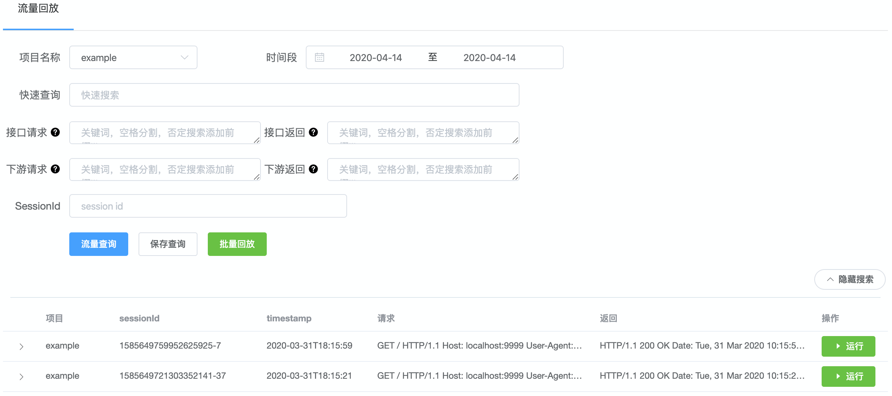
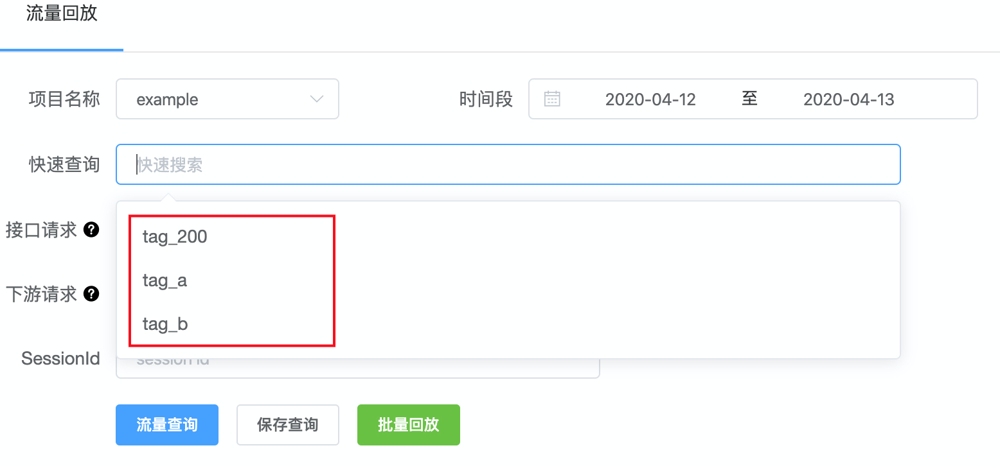
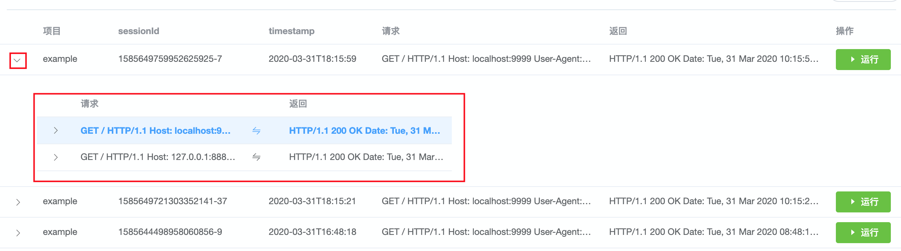
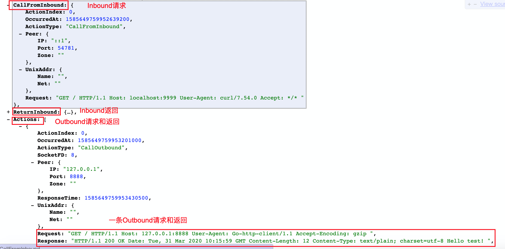

### 流量搜索指南

 

流量搜索指南可以帮助我们方便、快速的搜到想要的流量。

 

#### 一、 简单搜索

##### 1. 搜索界面介绍

**项目名称**：就是已经支持回放的业务模块

**时间段**：流量的起止时间范围，时间精度(天)。如果默认选择今天的日期，表示今天0点到now的时间段

**快速查询**：输入 上报DSL时填写的tag值，即可自动填充下面各查询字段

**接口请求**：Inbound Request的关键词，空格分隔，如 具体URI 或 某个header "Host: localhost:9999"。搜索本地流量只支持Inbound Request的一个关键词。

**接口返回**：Inbound Response的关键词，空格分隔，如 具体返回结果 "Hello world!" 或 某个header "Date: Tue, 31 Mar 2020 10:15:59 GMT"。搜索本地流量只支持Inbound Response的一个关键词。

**下游请求**：Outbound Request的关键词，同 接口请求

**下游返回**：Outbound Response的关键词，同 接口返回

**SessionId**: 每条流量都有一个唯一ID，形如xxx-x，由时间戳和goroutineid组成。

 

##### 2. 快速搜索

快速搜索栏中 自动加载了所有上报的DSL的tag值，选中一个tag后，页面会自动填充该tag的详细搜索条件，其目的是为了简化搜索的使用。

在使用搜索前，优先在快速搜索中查找，所以，tag的取名尽量有意义。详见：[DSL 上报指南](report.md#1-dsl上报)

如下图，首页搜索的流量，点击左侧按钮，可以展开查看该流量包含的所有请求，第一个为Inbound请求，后面的为Outbound请求。

 

##### 3. 搜索thrift请求
如果想搜索包含thrift下游请求的流量，下面有个高效搜索技巧。

由于thrift服务是非ascii编码，所以在存储的时候，recorder-agent 做了一些简单的操作，就是在存到ES的时候做了编码。因此，查询 'GetShaRinGanFlowTime'的方式有两种：

* x14GetShaRinGanFlowTime :
前面"x14"是什么意思呢，这个是'GetShaRinGanFlowTime'方法名长度的16进制表示，x14就表示20个字符长度
* x*MultiAreaInfoByCoord :
'\*'是通配符，表示可以匹配任意字符（详情见 [2. 通配符搜索](#2-通配符搜索)），注意头部的'x'字符不要丢掉，缺少'x'会全局搜索，速度极慢。

 

##### 4. 搜索http请求
由于浏览器及SUT都会对http参数进行urlencode操作，如果单纯的使用 "key"="value" 搜索，将搜索不到数据。

查询条件应该被设置为%22key%22%3A%22value%22，这是因为在ES中，%22没有被当做 '"' 进行分词，因此必须作为一个整体来搜索。

 

##### 5. 流量详情
在首页点击流量右侧"运行"的时候，会跳转到回放页面，如下：

点击红框的 sessionid超链接，会展示该流量的详情，即原始流量。

可以从上图复制 搜索thrift/http请求 需要的原始数据，如 'x14GetShaRinGanFlowTime'。

 

#### 二、 高级搜索

##### 1. 否定搜索

对于存储在ES里的流量，如果我们想要搜索某个关键词不存在的情况，可以借助否定搜索快速实现。

用法：在想要排除的 关键词 前面添加 '!' 符号即可，注意 '!' 和 搜索条件之间没有空格。 

如!Hello，搜索不包含Hello关键词的流量。

否定搜索的作用范围如下：
* 接口请求
* 接口返回
* 下游请求
* 下游返回

 

##### 2. 通配符搜索

当搜索词中包含随机串时，可以通过 通配符 搜索实现具体需求。

目前支持的通配符包含以下两个：
* ? : 匹配任何一个字符（长度为1）
* \* : 匹配任何一个字符串（长度为0~MAX_INT）

通配符在搜索词中的位置：
* 前置：搜索非常慢，因为需要全域搜索，不保证能出结果
* 中置：搜索比较快
* 后置：搜索比较快

对通配符的数目没有限制，用户可以使用多种组合。

 

> 以 [搜索thrift请求](#3-搜索thrift请求) 示例

常规搜索：x14GetShaRinGanFlowTime

前置搜索：*GetShaRinGanFlowTime   或  ???GetShaRinGanFlowTime

中置搜索：x*GetShaRinGanFlowTime  或  x??GetShaRinGanFlowTime

后置搜索：x14GetShaRinGan* 或 x14GetSha?in?an*
