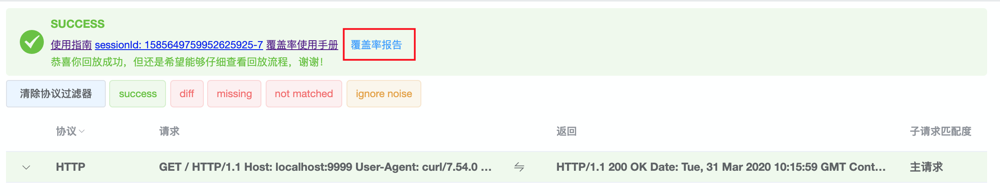
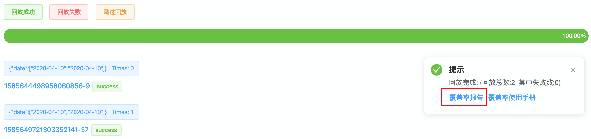
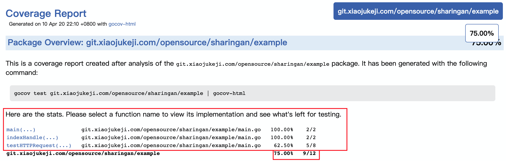
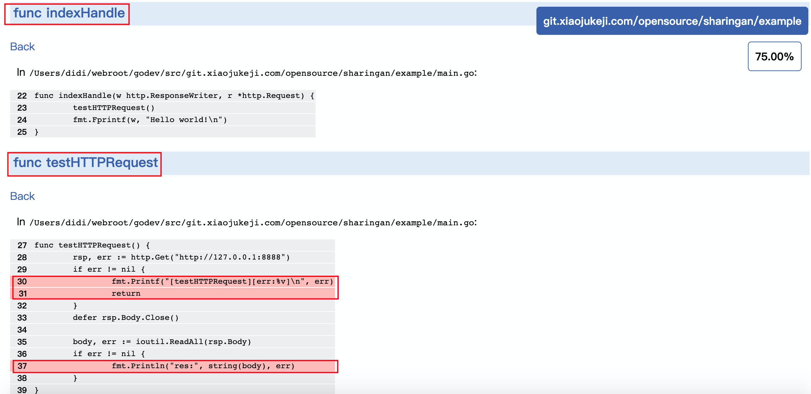

### 覆盖率统计回放

<br>

覆盖率统计回放，即流量回放的同时，支持被测代码覆盖率统计，并生成覆盖率报告。

<br>

#### 一、接入方式

回放前提：已经完成流量录制。[录制接入文档](../recorder/README.md)

对于服务启动阶段有TCP请求的SUT，如初始化连接池等，推荐 服务启动顺序：
* 先启动Agent 
* 再启动SUT

##### 1. 配置并启动Agent

同 [回放接入-1. 配置并启动Agent](./README.md#1-配置并启动agent)

##### 2. 配置并启动SUT

> 同样需要使用定制的golang。

首先，配置定制版golang环境。同 [回放接入-2. 配置并启动SUT](./README.md#2-配置并启动sut) 内定制版golang的配置操作。
```shell script
curl https://github.com/didichuxing/sharingan-go/raw/recorder/install/go1.10 | sh
&& export GOROOT=/tmp/recorder-go1.10
&& export PATH=$GOROOT/bin:$PATH
```
然后，新增 [main_test.go](../../replayer-agent/install/codeCov/main_test.go) 文件到SUT的根目录。(对于[支持flag的SUT](#2-支持sut使用flag)，仅此步不同)

最后，使用go test 命令编译代码 并 启动SUT服务。
> 温馨提示：
> 默认统计全模块覆盖率，如需缩小统计范围，请修改-coverpkg指定特定目录，可以提高代码覆盖率
```shell script
go test -gcflags="all=-N -l" -tags="replayer" -v -c -covermode=count -coverpkg ./...
```
> 相比普通回放，启动命令 多了两个参数 -systemTest -test.coverprofile。
```shell script
#linux下启动：
nohup ./$binName.test -systemTest -test.coverprofile=/tmp/ShaRinGan/coverage.$binName.cov >> run.log 2>&1 &
#mac下启动(务必 绝对路径 启动):
nohup /xx/$binName.test -systemTest -test.coverprofile=/tmp/ShaRinGan/coverage.$binName.cov >> run.log 2>&1 &
```
> SUT一键接入和启动[脚本](../../example/replayer/sut_replayer.sh) 及其 [使用方法](./replayer-sut.md)

至此，浏览器打开 [http://127.0.0.1:8998](http://127.0.0.1:8998) 或 local_ip 即可开始回放啦~

<br>

#### 二、使用

##### 1. 覆盖率报告

覆盖率报告支持 多次回放后的 **累计覆盖率统计** ；即 在SUT启动后，可以进行多次回放测试，最后统一查看覆盖率报告。

覆盖率报告的查看点有两处：

A. 单流量回放结果页



B. [批量回放](./replayer-parallel.md)结果页



> 注意：
> 
> a.点击 "覆盖率报告" 链接后，Agent会 **自动重启SUT服务**。所以，覆盖率数据会重新统计!!!
>
> b.上面两处 "覆盖率报告" 链接 点击效果一样。覆盖率统计不区分单流量回放和批量回放，会一起统计。


覆盖率报告 不仅会给出 整体覆盖结果，还会给出 每个函数的覆盖率结果和覆盖详情。



下面是每个函数具体覆盖详情，其中 红色为未覆盖代码。



<br>

##### 2. 支持SUT使用flag

对于使用flag的SUT，不仅需要新增test文件，还需要改造main.go代码。

a. 新增 [main_flag_test.go](../../replayer-agent/install/codeCov/main_with_flag/main_flag_test.go) 文件到SUT根目录。

b. 按 [main_flag.go](../../replayer-agent/install/codeCov/main_with_flag/main_flag.go) 文件注释里的TODO修改代码即可。

其他接入操作不变，同 [配置并启动SUT](#2-配置并启动sut)。

<br>

##### 3. 历史覆盖率报告

历史覆盖率报告存放在本机 /tmp/ShaRinGan/ 目录下。

a. 覆盖率原始报告, 命名格式 coverage.$binName.$timestamp
> $timestamp 一般包括起始和终止两个时间戳。对于初始手动启动SUT的情况，只有终止时间戳。对于Agent自动启动SUT的情况，都有起始和终止两个时间戳。

b. 格式化后的 *.html 报告，命名格式 coverage.$binName.$timestamp.html
> 意外惊喜：历史 *.html 报告，可通过接口 http://127.0.0.1:8998/coverage/report/coverage.$binName.$timestamp.html 查看。

由于历史报告保存在/tmp临时目录下，所以对于想长期保存的历史报告，请及时备份。

