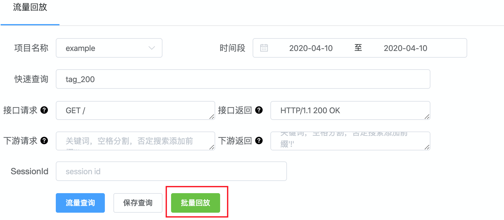
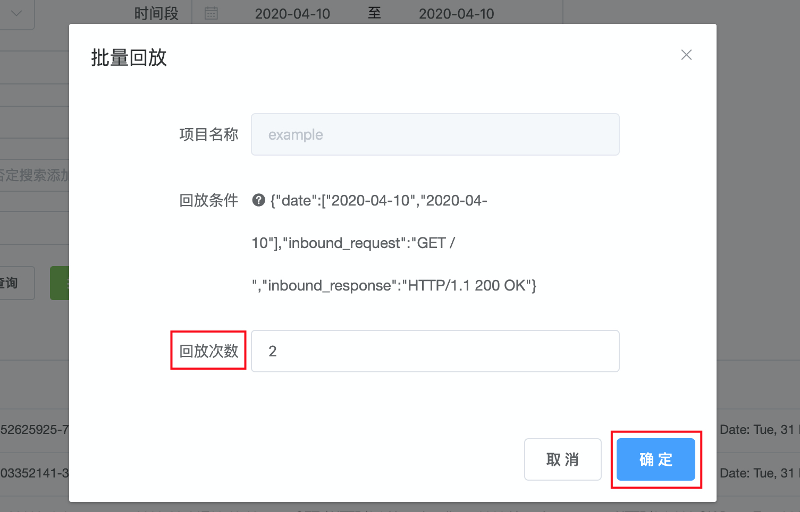
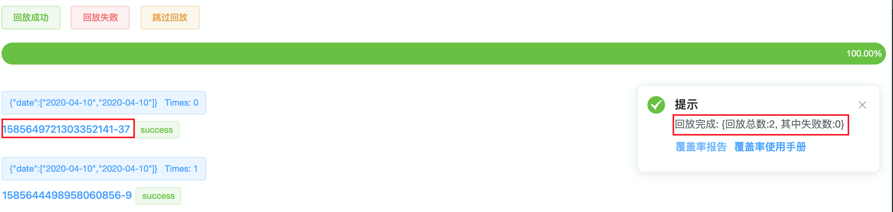
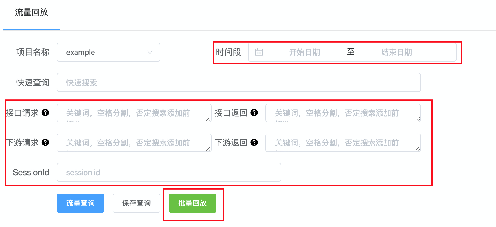
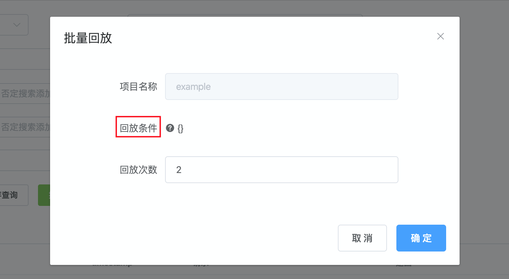

### 批量并发回放

为了提高测试效率，Agent还支持了 批量并发 回放。
 

##### 1. 并发度

Agent启动时，默认的并发度是 parallel=10。
> 温馨提示：
> 当批量回放的流量总数小于parallel时，并发度自动调整为流量总数大小。

如需调整并发度，只需在启动Agent时增加 -parallel 参数即可。
```shell script
cd ./replayer-agent && go build && nohup ./replayer-agent -parallel=x 2>&1 &
```

##### 2. 使用

###### A. 普通使用

a. 在Agent首页，输入流量筛选条件。



b. 点击 "批量回放"，即可看到下面的弹出框。



回放次数 默认是2，即 根据 "回放条件" 筛选的所有流量里，选择2个流量进行批量回放。用户可以根据需求修改。

> 温馨提示：
> 如果输入的 "回放次数" 大于 "回放条件" 实际筛选的流量总数，则最终以实际筛选的流量总数为准。

批量回放结果如下：



回放结束，右侧 会给出整体真实的回放次数，及失败次数。左侧 会给出具体回放的流量详情及结果，点击流量id还可以进行单流量回放。


###### B. 彩蛋

对于 已经根据 [噪音/DSL 上报指南](./guide/report.md#1-dsl上报) 上报了一些DSL的用户，可以批量回放 **所有DSL** 对应的流量。

a. 操作非常简单，只需保证Agent首页没有输入任何筛选条件，包括 **"时间段""** 参数。



b. 点击 "批量回放" 后，确认 "回放条件" 是空的。



这里的 "回放次数" 与普通使用不同，这里指的是 **每个DSL** 对应流量的回放次数。即， 如果总共上报了10个DSL, "回放次数" 使用默认值2，那么总回放流量为 10*2=20 个。

> 温馨提示：
> 如果输入的 "回放次数" 大于 某个DSL实际对应的流量总数，则 该DSL只回放实际流量数目，其他DSL不受影响。
