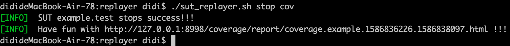

### SUT一键接入和启动脚本

<br>

[./example/replayer/sut_replayer.sh](../../example/replayer/sut_replayer.sh) 脚本是 [流量回放-2. 配置并启动SUT](./README.md#2-配置并启动sut) 示例 example 的一键安装和启动脚本。 

<br>

用户可以 **基于此脚本** 进行修改和定制。

##### 1. 环境

* GO 「定制版本golang，目前支持go1.10、go1.11、go1.12、go1.13」
* 包管理工具由SUT决定 (GO>=1.13推荐go mod, 低版本推荐glide)

<br>

##### 2. 使用

下面的命令都是基于 **sharingan/example/replayer** 操作的，相当于SUT的根目录。

> 构建（build）

检测GO环境并编译SUT服务。

此脚本默认使用glide包管理工具，对于没有GO环境的机器，会自动安装golang1.10、glide，并设置GOROOT、GOPATH。 [golang安装](https://github.com/didichuxing/sharingan-go)。

使用gomod包管理的脚本即将提供~

```shell
sh sut_replayer.sh build     //普通回放
sh sut_replayer.sh build cov //覆盖率回放
```

> 启动（start）

启动SUT服务。
```shell
sh sut_replayer.sh start     //普通回放
sh sut_replayer.sh start cov //覆盖率回放
```

> 停止（stop）

停止SUT服务。
```shell
sh sut_replayer.sh stop     //普通回放
sh sut_replayer.sh stop cov //覆盖率回放
```
停止SUT时，覆盖率回放方式 会给出覆盖率报告 及 可以直接查看的html链接。覆盖率报告详细说明：[覆盖率报告](./replayer-codecov.md#1-覆盖率报告)


> 重启（reload）

重启SUT服务。
```shell
sh sut_replayer.sh reload     //普通回放
sh sut_replayer.sh reload cov //覆盖率回放
```

<br>

##### 3. 与Agent分开部署

SUT与Agent服务可以在不同的机器分开部署，其中Agent的Mock Server监听端口3515也可以修改。
> 分开部署

  1. 启动Agent服务。参见: [Agent启动脚本](./replayer-agent.md)
  2. 修改脚本 [./example/replayer/sut_replayer.sh](../../example/replayer/sut_replayer.sh) 里的 REPLAYER_MOCK_IP 环境变量，为Agent的ip地址。
  3. 重启SUT服务即可。

> 修改Mock Server 3515端口

  1. 使用新端口 修改 [Agent配置-outbound](./replayer-conf.md#3-outbound) 字段
  2. 重启Agent服务。参见: [Agent启动脚本](./replayer-agent.md)
  3. 修改脚本 [./example/replayer/sut_replayer.sh](../../example/replayer/sut_replayer.sh) 里的 REPLAYER_MOCK_PORT 环境变量，为Mock Server新端口。
  4. 重启SUT服务即可。