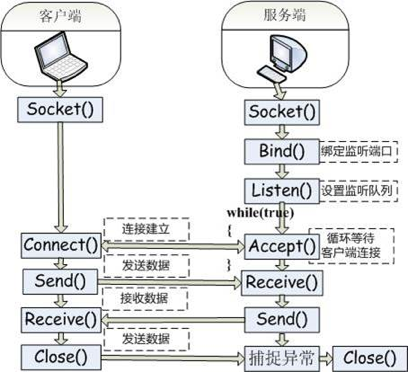
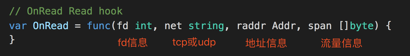

# 拦截点选择

## 一、选择

流量录制必然要在某个点上对流量进行拦截并镜像，常见的拦截方式如下：

分析：

* 为了做到尽量无业务浸入、具体框架无关，业务代码和rpc框架拦截方式不适合。
* syscal拦截成本高，到tcp/ip协议栈的时候线程等信息丢失更不容易区分，所以后面几种方式都不适合。

综上，比较适合拦截的方式是libc、语言标准库。

* 对于底层使用libc的语言，如php，可以在libc进行拦截。参考：[rdebug](https://github.com/didi/rdebug)
* 对于没有使用libc的语言，如golang，可以在语言标准库上修改做拦截。

## 二、golang实现（语言标准库拦截）

socket通信基本流程图如下，需要在Connect、Accept、Send、Receive、Close等阶段加钩子拦截并镜像流量。

### 2.1、方案

* 修改golang源码，相应提供OnConnect、OnAccept、OnRead、OnWrite、OnClose等函数，详见：[sharingan-go](https://github.com/didichuxing/sharingan-go)
* 提供录制包实现上述Hook接口，详见：[recorder包](https://github.com/didichuxing/sharingan/tree/master/recorder)

### 2.2、示例

* inbound请求经历的Hook如下：

> OnAccept() -> OnRead() -> OnWrite() -> OnClose()

* outbound请求经历的Hook如下：

> OnConnect() -> OnWrite() -> OnRead() -> OnClose()

* 核心OnRead拦截函数如下：

* 核心OnWrite拦截函数如下：

