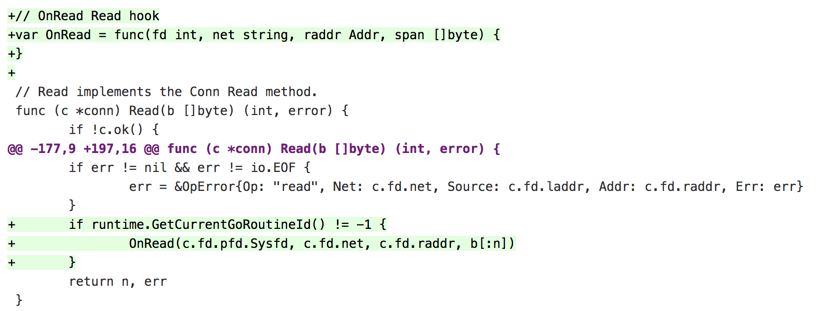
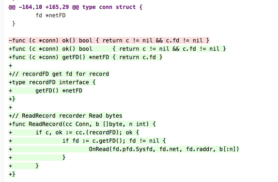
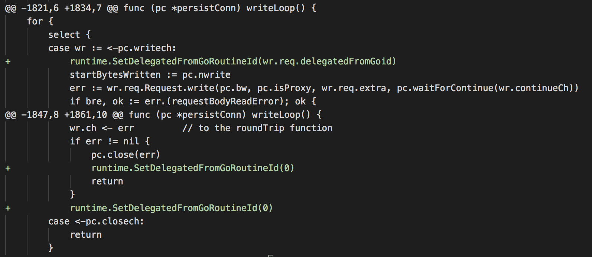

# 流量丢弃和恢复

## 一、背景

golang在读完一个http请求数据之后会开启一个goroutine判断pipeline请求。详见：[startBackgroundRead](https://github.com/golang/go/blob/release-branch.go1.10/src/net/http/server.go#L653)

判断方法是读一个字节判断，如果有pipeline请求，会将下一个请求的第一个字节读取存在一个byteBuf里。

大部分的流量拦截都是在net.Read函数加OnRead钩子，对于上述场景会将下一个请求第一个字节提前读出。

日志观察如下：

所以，我们有必要提供方法主动控制流量的录制。

## 二、原理

### 2.1、流量丢弃

不是所有经过conn.Read()的流量都会录制，设置-1的流量不录制。

### 2.1、流量恢复

单独提供方法可以让程序在需要的时候主动录制流量，而不需要经过conn.Read()调用。

## 三、应用

### 3.1、pipeline处理

在backgroundRead读取byteBuf阶段，忽略这一个字节流量的录制。在下一个请求读取byteBuf的时候再恢复录制。

### 3.2、对外HTTP请求

golang对外处理http请求时，每个连接会开启两个goroutine处理，go pconn.ReadLoop() 和 go pconn.WriteLoop()。

* 对于WriteLoop，可以从writech里面获取当前inbound请求的goroutineID（wr.req.delegatedFromGoid），然后通过工作委托的方式进行设置。

* 对于ReadLoop，先读取Conn数据，再从reqch获取当前inbound请求的goroutineID，在调用Conn Read的时候还不知道要设置的goroutineID。

方案：在Conn.Read阶段将流量丢弃，在取出reqch得到inbound请求的goroutineID后，再主动录制流量。

> 这个里面还需要单独提供函数读取pc.br缓存的buffer数据，默认不提供ReadBuffer()接口

