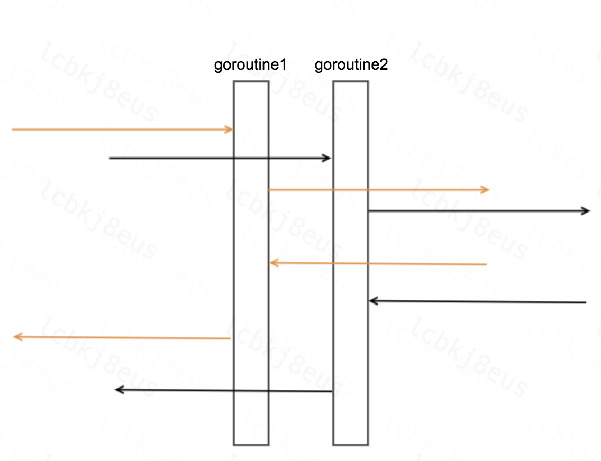
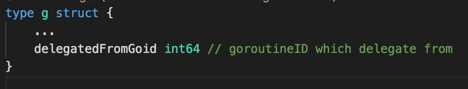
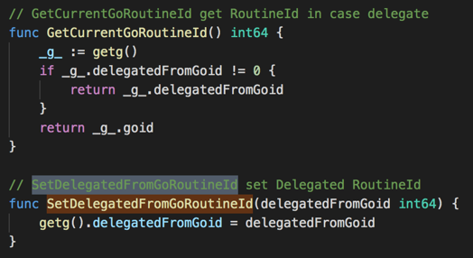

# 链路追踪

* 分析

常见方式是使用TraceID将链路串联起来，需要业务代码配合修改，不容易全面覆盖，对于我们的场景少录一个流量都无法回放。

* 思路

对于大部分场景inbound请求和outbound请求在一个goroutine里面完成。（如：mysql、redis、thrift等）

* 方案

使用goroutineID来关联inbound和outbound请求，对于大部分场景都适用，对于并发等不在一个goroutine处理的请求，需要使用工作委托技术。

## 工作委托

* 在goroutine结构体里面增加一个delegatedFromGoid属性，标识从哪个goroutine委托过来的。

* 对外暴露GET/SET方法

* 示例

