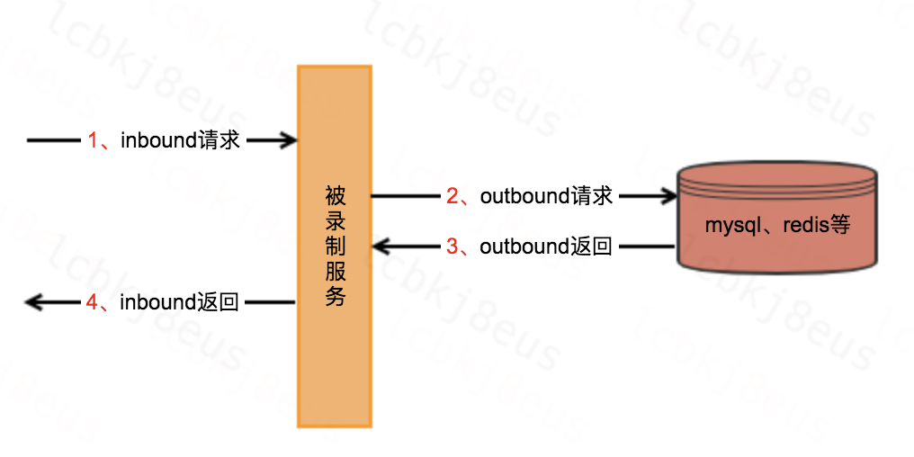

# 流量录制

## 一、简介

功能：将线上的真实请求流量录制下来，包含调用下游服务的流量，如：下图1，2，3，4流量

名词解释：

* inbound：服务接受的请求。
* outbound：服务下游的请求。

## 二、挑战

* 在哪里拦截流量？详见: [拦截点选择](./recorder-choose.md)。
* 怎么把流量串联起来？详见: [链路追踪](./recorder-trace.md)。

## 三、其它

* 在处理pipeline请求、对外http请求时需要特殊设置，详见: [流量丢弃和恢复](./recorder-discard_recover.md)。
